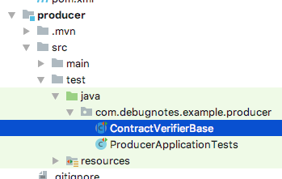

# How to Setup Spring Cloud Contract (Basic Configuration)

Consumer Driven Contract testing allows a developer to create automated tests for 
communications between a network client (re: consumer) application and the remote 
endpoints on a server/api (re: producer) application, typically done by making a 
RESTful HTTP call against a url. With Spring Cloud Contract, the amount of code 
needed to test those endpoints is reduced over traditional testing methods and is 
also made more easily accessible to multiple consumers that share a common producer's 
api - which is especially useful in microservices environments where requirements 
for repeated testing may occur.

Spring Cloud Contract is in no way meant to replace regular unit testing, but rather 
supplement it by adding the ability for a consumer to "mock" the producer it is connecting 
to during testing. How this is accomplished is by configuring the producer and consumer 
accordingly, noting that an application can also be both a consumer and a producer
(i.e. middleware) by merging the two configurations as required.

To setup a basic Spring Cloud Contract for a Producer and a Consumer, follow the 
steps below by creating the contracts for the producer first, and then the tests using 
those contracts in consumer afterward.

The producer project must be successfully execute the "install" phase before the 
consumer project will be able to see the contracts available for a producer (see below).

## Producer Configuration

### 1.      Add Spring Cloud Contracts verifier dependency to the pom.xml in the producer project.


To enable support for spring contracts in the producer, the dependency 
spring-cloud-starter-contract-verifier must be added to the producer's pom.xml, 
plus other management dependencies.

With this dependency, contracts written as Groovy scripts can be used to auto-generate test 
classes (re: code) to test the producer's RESTful endpoint(s). When all the tests pass, the groovy script(s) 
becomes known as the stubs for the producer's endpoint, and all stubs are stored in separate -stubs.jar file 
that is generated during the install phase of building a producer application's .jar file (see step 4. below).
```
<dependencies>
    <dependency>
        <groupId>org.springframework.cloud</groupId>
        <artifactId>spring-cloud-starter-contract-verifier</artifactId>
        <scope>test</scope>
    </dependency>
<dependencies>
```


### 2. Add Spring Cloud Contract verifier base class to producer's test configuration.


When the producer's test are run, the Spring Cloud Contract verifier reads the groovy scripts located in 
source at /src/test/resources/contracts/* and then generates the actual Java test code (re: classes with java code, 
annotated with @Test) which is then subsequently used by the maven surefire plugin to test the producer's endpoint(s).
 (See step 3 below.) This verifies both the contract and producer are correct for the stubs file.

Test classes that are autogenerated from groovy scripts live in the project folder at 
/target/generated-test-sources/contracts, and always derive themselves from a named 
abstract base class, which is stored with the producer in the /src/test/java folder 
(and then further configured using the maven-spring-cloud-contract plugin). This 
abstract base class (default name is ContractVerifierBase) allows pre-configuration of 
the stubs and is typically used to specify the mocking server's context for each test.
```
<build>
    <plugins>
        <plugin>
            <groupId>org.springframework.boot</groupId>
            <artifactId>spring-boot-maven-plugin</artifactId>
        </plugin>
        <plugin>
            <groupId>org.springframework.cloud</groupId>
            <artifactId>spring-cloud-contract-maven-plugin</artifactId>
            <version>${spring-cloud-contract-maven-plugin.version}</version>
            <extensions>true</extensions>
            <configuration>
                <baseClassForTests>com.debugnotes.example.contract.producer.ContractVerifierBase</baseClassForTests>
                <!--<packageWithBaseClasses>com.debugnotes.example.contract.producer</packageWithBaseClasses>-->
            </configuration>
        </plugin>
    </plugins>
</build>
```

```
package com.debugnotes.example.contract.producer;

import io.restassured.module.mockmvc.RestAssuredMockMvc;
import org.junit.Before;
import org.junit.runner.RunWith;
import org.springframework.beans.factory.annotation.Autowired;
import org.springframework.boot.test.context.SpringBootTest;
import org.springframework.test.context.junit4.SpringRunner;
import org.springframework.web.context.WebApplicationContext;

@RunWith(SpringRunner.class)
@SpringBootTest (classes=ProducerApplication.class)
public abstract class ContractVerifierBase {

    @Autowired
    WebApplicationContext webApplicationContext;

    @Before
    public void setup() {
        RestAssuredMockMvc.webAppContextSetup(webApplicationContext);       // mocks all controllers
        // RestAssuredMockMvc.standaloneSetup(new ServerDefaultController());  // mocks specific controller
    }
}
```




###3. Ensure all controllers to be mocked have their endpoints include the correct "producer" properties:

 
```
@Controller
@RequestMapping("/")
public class DefaultController {

    @RequestMapping(produces = "application/json")  // for contract testing, MUST USE "produces=", "consumes=" params,
    // "headers=" is insufficient for testing, but can still be used!!!
    @ResponseBody
    public String get() {
        return "{}";
    }
}
```

 

If a controller does not include this then it runs the risk of not being stubbed and it may 
return a 404 error on the consumer when contracts are testing.


### 4. Write one or more Spring Cloud Contract files (groovy scripts) as tests for the producer's api, and put them in the /src/test/resources/contracts/ folder on the server.

The contracts (as groovy scripts) themselves contain a description of the stubs and the expected
behavior of a stubbed producer based on the configuration of the RESTful call.


```

package contracts;


org.springframework.cloud.contract.spec.Contract.make {
	description("""
Represents a successful scenario of getting a contract

``
given:
	testing a contract
when:
	calling a service
then:
	respond with a json object
``

""")
	request {
		method 'GET'
		url '/profile'
	}
	response {
		status 200
		body("""
			{"cards":[],"id":101}
		""")
		headers {
			contentType(applicationJson())
		}
	}
}

```


```

package com.debugnotes.example.contract.producer;

import com.debugnotes.example.contract.producer.ContractVerifierBase;
import com.jayway.jsonpath.DocumentContext;
import com.jayway.jsonpath.JsonPath;
import io.restassured.module.mockmvc.specification.MockMvcRequestSpecification;
import io.restassured.response.ResponseOptions;
import org.junit.Test;

import static com.toomuchcoding.jsonassert.JsonAssertion.assertThatJson;
import static io.restassured.module.mockmvc.RestAssuredMockMvc.*;
import static org.springframework.cloud.contract.verifier.assertion.SpringCloudContractAssertions.assertThat;

public class ContractVerifierTest extends ContractVerifierBase {

	@Test
	public void validate_shouldGetFileNotFound() throws Exception {
		// given:
			MockMvcRequestSpecification request = given();

		// when:
			ResponseOptions response = given().spec(request)
					.get("/some-unknown-url");

		// then:
			assertThat(response.statusCode()).isEqualTo(404);
	}

	@Test
	public void validate_shouldGetOK() throws Exception {
		// given:
			MockMvcRequestSpecification request = given();

		// when:
			ResponseOptions response = given().spec(request)
					.get("/");

		// then:
			assertThat(response.statusCode()).isEqualTo(200);
	}

	@Test
	public void validate_shouldGetProfile() throws Exception {
		// given:
			MockMvcRequestSpecification request = given();

		// when:
			ResponseOptions response = given().spec(request)
					.get("/profile");

		// then:
			assertThat(response.statusCode()).isEqualTo(200);
			assertThat(response.header("Content-Type")).matches("application/json.*");
		// and:
			DocumentContext parsedJson = JsonPath.parse(response.getBody().asString());
			assertThatJson(parsedJson).field("['id']").isEqualTo(101);
			assertThatJson(parsedJson).array("['cards']").isEmpty();
	}

}

```

### 5. Run the install phase of the producer's project and ensure that a -stubs.jar file is created and installed to your local maven repository.

When the setup is correct, there should be two (2) jar files in the target folder of the application 
after running the install phase: the application's own .jar file, as expected, and then a second 
.jar file with the suffix *-stubs.jar. This stubs file (*-stubs.jar) is what is used by the consumer 
to mock the producer's api during testing and is stored in your local maven repository 
(i.e. ~/.m2/repository) - but only during the "install" phase by maven. This is done so that multiple different 
consumers can access the stubs file for a producer's contracts. Spring Cloud Contract verifier uses 
your local maven repo to share the stubs it creates for a producer.


## Consumer Configuration

### 6. Add Spring Cloud Contracts stub runner dependency to the pom.xml in the consumer project.
After adding the spring-cloud-starter-contract-stub-runner dependency to the project's pom.xml file, 
a test class can be created that allows it to use dependency injection (re: @Autowire annotations) 
to connect to the stubs via MockMvc. @Test(s) can then be written using the injected variable to 
mock the producer during testing of the consumer.

```
<dependencies>
    <dependency>
        <groupId>org.springframework.cloud</groupId>
        <artifactId>spring-cloud-starter-contract-stub-runner</artifactId>
        <scope>test</scope>
    </dependency>
</dependencies>
```
### 7. Create test classes with stub runner annotations to allow testing of the producer's endpoints.

Configuring the consumer can be a bit tricky because the stubs of the producer are referenced by 
package name in the consumer, which assumes that they are already installed. When stubsmode is 
set to LOCAL Spring Cloud Contract uses your local maven repository (i.e. ~/.m2/repository) to 
allow a consumer to access a producer's stub files. It is important to note that by using Maven's 
local repository, anytime a Contract's groovy file changes, the producer application must be 
"re-installed" in order to publish the changes in a producer's stubs file so that they are 
visible to consumer applications.

```
package com.debugnotes.example.contract.consumer.controller;

import com.debugnotes.example.contract.consumer.ConsumerApplication;
import org.junit.Test;
import org.junit.runner.RunWith;
import org.springframework.beans.factory.annotation.Autowired;
import org.springframework.boot.test.autoconfigure.web.servlet.AutoConfigureMockMvc;
import org.springframework.boot.test.context.SpringBootTest;
import org.springframework.cloud.contract.stubrunner.spring.AutoConfigureStubRunner;
import org.springframework.cloud.contract.stubrunner.spring.StubRunnerProperties;
import org.springframework.http.MediaType;
import org.springframework.test.context.junit4.SpringRunner;
import org.springframework.test.web.servlet.MockMvc;
import org.springframework.test.web.servlet.MvcResult;
import org.springframework.test.web.servlet.ResultActions;
import org.springframework.test.web.servlet.request.MockMvcRequestBuilders;
import org.springframework.web.context.WebApplicationContext;

import static org.springframework.test.web.servlet.request.MockMvcRequestBuilders.get;
import static org.springframework.test.web.servlet.result.MockMvcResultHandlers.print;
import static org.springframework.test.web.servlet.result.MockMvcResultMatchers.content;
import static org.springframework.test.web.servlet.result.MockMvcResultMatchers.status;

@RunWith(SpringRunner.class)
@SpringBootTest(classes = {ConsumerApplication.class})
@AutoConfigureMockMvc
@AutoConfigureStubRunner(ids = {"com.debugnotes.example.contract:producer:+:stubs:8081"},
        stubsMode = StubRunnerProperties.StubsMode.LOCAL)
//@DirtiesContext // use only if the application context needs to be reset after these tests
public class DefaultControllerTest {

    @Autowired
    private MockMvc mockMvc;

    @Test
    public void testRemoteServer() throws Exception {
        String expectedContent = "{&quot;cards&quot;:[],&quot;id&quot;:101}";
        MvcResult mvcResult = mockMvc.perform(MockMvcRequestBuilders.get("/")
                .contentType(MediaType.APPLICATION_JSON_VALUE))
                .andExpect(status().isOk())
                .andReturn();

        String result = mvcResult.getResponse().getContentAsString();
        if (result == null || result.length() <= 0)
            result = "<EMPTY>";
        if (result.contains(expectedContent) == false) {
            throw new Exception("Error - expected content: " + expectedContent + " result: " + result);
        }
    }

}
```
## Notes

A consumer driven contract is meant to be defined/written by the developer of the consumer's tests, which 
then is given to the developer of the producer, who is then tasked with writing the necessary 
producer side code to fulfill the contract. If done correctly, a set of contracts should define exactly 
what a producer application needs to provide to work with all consumers, and only those things, 
ensuring that only the required amount of work is being done by the producer's developers.

This approach to testing also scales up incredibly well. When multiple contracts are supplied 
from different consumers, tests for all can be autogenerated on the producer, making writing 
tests for microservices architectures much easier.

To understand how to write a Groovy Contract, follow the same methodology as cucumber tests 
(see: https://docs.cucumber.io).
